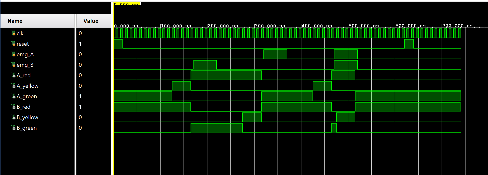
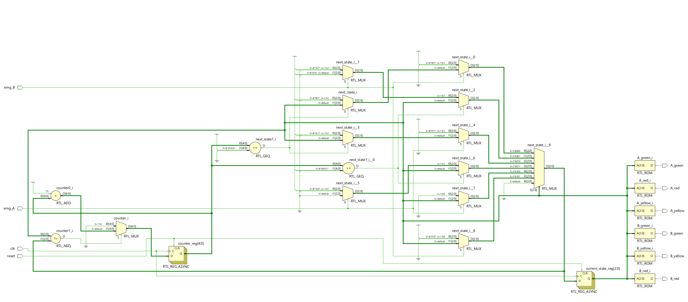
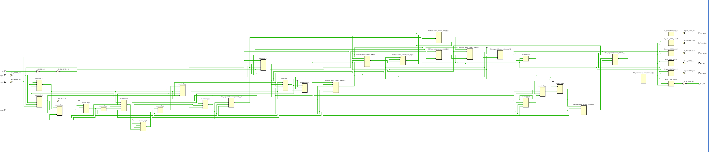
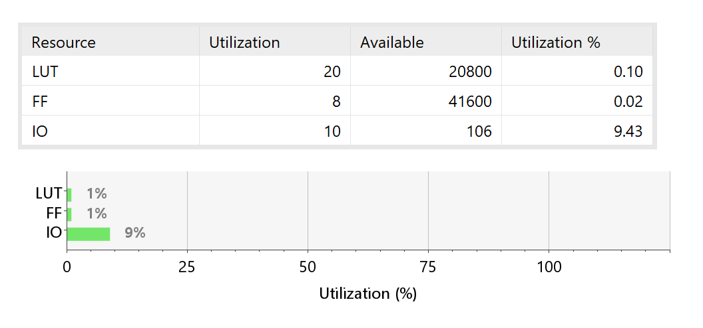
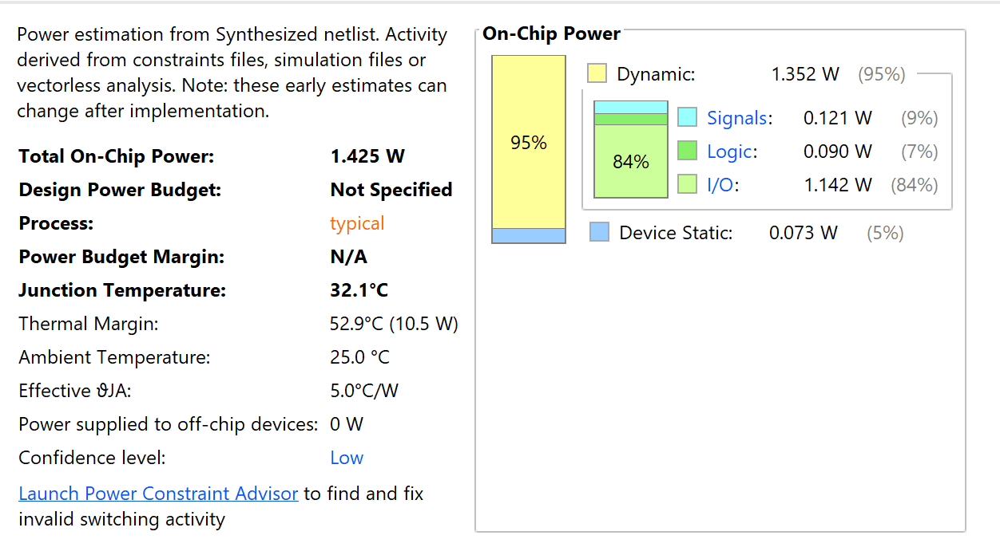

# traffic-light-controller-emergency-priority
Verilog-based Traffic Light Controller with Emergency Priority using Moore FSM. Includes RTL design, simulation, synthesis, resource utilization, and power analysis using AMD Vivado 2025.2.


# 🚦 Traffic Light Controller with Emergency Priority System using Verilog HDL


## 📌 Project Overview

This project implements a **Traffic Light Controller with Emergency Priority Support** using **Verilog HDL** and a **Moore Finite State Machine (FSM)** architecture.

The controller manages traffic flow at a two-road intersection under normal operating conditions while allowing emergency vehicles such as ambulances, fire engines, and police vehicles to obtain temporary priority access through an override mechanism.

The complete RTL design flow including **design entry, simulation, synthesis, resource utilization analysis, and power estimation** was performed using **AMD Vivado 2025.2**.

> **Note:** FPGA hardware implementation was not performed due to the unavailability of an FPGA development board. The project was fully verified through simulation and post-synthesis analysis.

---

## ✨ Features

- Moore FSM based traffic controller
- Emergency vehicle priority support
- Safe traffic transitions using yellow states
- Separate emergency handling states
- Functional verification using simulation
- RTL synthesis using AMD Vivado 2025.2
- Resource utilization analysis
- Power estimation and thermal analysis

---

## 🏗️ System Architecture

The controller consists of:

- FSM Controller
- Counter and Timing Logic
- Emergency Detection Logic
- Output Decoder Logic

### System Architecture Flow

```text
Requirements Analysis
        ↓
FSM Design
        ↓
RTL Implementation
        ↓
Simulation and Verification
        ↓
RTL Synthesis
        ↓
Resource & Power Analysis
```

---

## 🔄 FSM State Description

| State | Description |
|-------|-------------|
| S0 | Road A Green, Road B Red |
| S1 | Road A Yellow, Road B Red |
| S2 | Road A Red, Road B Green |
| S3 | Road A Red, Road B Yellow |
| S4 | Emergency Priority for Road A |
| S5 | Emergency Priority for Road B |

---

## 🚑 Emergency Priority Mechanism

The controller supports emergency requests from both roads.

### Emergency Request on Road A

```text
Normal Operation
      ↓
Emergency Detected
      ↓
Complete Yellow Transition
      ↓
Grant Green to Road A
      ↓
Emergency Cleared
      ↓
Resume Normal Operation
```

### Emergency Request on Road B

```text
Normal Operation
      ↓
Emergency Detected
      ↓
Complete Yellow Transition
      ↓
Grant Green to Road B
      ↓
Emergency Cleared
      ↓
Resume Normal Operation
```

---

## 📂 Repository Structure

```text
traffic-light-controller-verilog/
│
├── images/
│   ├── improved_op_waveform.png
│   ├── rtl_design.png
│   ├── synthesised_design.png
│   ├── resource_report.png
│   ├── power_report.png
│   └── README.md
│
├── report/
│   ├── Project_Report_Traffic_Light_Controller.pdf
│   └── README.md
│
├── rtl/
│   ├── traffic_controller.v
│   └── README.md
│
├── tb/
│   ├── traffic_controller_improved_tb.v
│   └── README.md
│
├── LICENSE
└── README.md
```

## 🧪 Verification Scenarios

The testbench validates the following conditions:

- ✅ Reset functionality
- ✅ Normal traffic operation
- ✅ Emergency request on Road A
- ✅ Emergency request on Road B
- ✅ Simultaneous emergency requests
- ✅ Reset during operation

---

## 📈 Simulation Results

### Functional Simulation Waveform



The waveform verifies:

- Correct FSM transitions
- Proper emergency handling
- Safe traffic sequencing
- Successful reset operation

---

## 🔧 RTL Schematic



The RTL schematic confirms the expected architecture consisting of:

- State Registers
- Counter Logic
- Next State Logic
- Output Decoder

---

## ⚙️ Synthesized Design



The synthesized netlist confirms successful hardware mapping of the RTL description into FPGA resources.

---

## 📊 Resource Utilization



| Resource | Used | Available | Utilization |
|----------|------|-----------|-------------|
| LUT | 20 | 20800 | 0.10% |
| Flip-Flops | 8 | 41600 | 0.02% |
| I/O | 10 | 106 | 9.43% |

The results demonstrate an efficient and lightweight FSM implementation.

---

## 🔋 Power Analysis



| Parameter | Value |
|-----------|-------|
| Total On-Chip Power | 1.425 W |
| Dynamic Power | 1.352 W |
| Static Power | 0.073 W |
| Junction Temperature | 32.1 °C |

Most of the dynamic power is attributed to I/O activity while the logic power consumption remains minimal.

---

## 🛠️ Tools Used

| Category | Tool |
|----------|------|
| HDL | Verilog HDL |
| EDA Tool | AMD Vivado 2025.2 |
| Verification | Vivado Simulator |
| Synthesis | Vivado Synthesis |

---

## 📚 References

1. AMD Xilinx Vivado Design Suite User Guide.
2. Samir Palnitkar, *Verilog HDL: A Guide to Digital Design and Synthesis*.
3. M. Morris Mano, *Digital Design*.
4. John F. Wakerly, *Digital Design: Principles and Practices*.

---

## 🚀 Future Improvements

- Adaptive traffic timing
- Traffic density sensing
- Pedestrian crossing support
- FPGA hardware implementation
- Sensor integration for real-time deployment

---

## 👨‍💻 Author

**Shivam Chaurasiya**  
B.Tech Electronics and Communication Engineering  
Interest Areas: VLSI Design, RTL Design, Digital Design, Semiconductor Technology

---

## ⭐ If you found this project useful, consider giving it a star.
